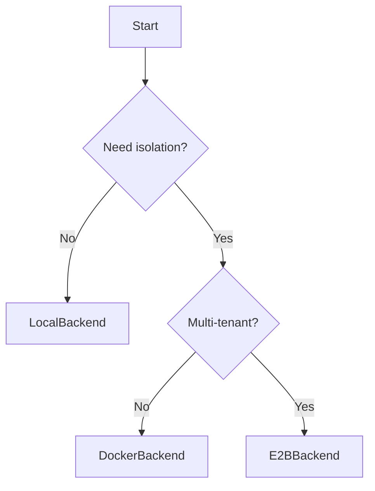

# Backends

Backends are execution environments where your AI agent's code runs. Omniagents provides three backends with identical interfaces.

## Backend Comparison

| Feature | LocalBackend | DockerBackend | E2BBackend |
|---------|-------------|---------------|------------|
| **Environment** | Host machine | Docker container | Cloud sandbox |
| **Isolation** | None | Container | Full sandbox |
| **Startup time** | Instant | ~2-5s | ~5-10s |
| **Dependencies** | None | Docker daemon | E2B API key |
| **Best for** | Development | Isolated testing | Production |
| **Cost** | Free | Free | Pay per use |

## LocalBackend

Runs code directly on your machine. Fast and simple, but no isolation.

```python
from omniagents.backends.local_backend import LocalBackend
from omniagents.backends.state_manager import NoOpStateManager

backend = LocalBackend(
    project_id="my-project",
    state_manager=NoOpStateManager()
)
backend.start()

# Files are created in: data/my-project/
result = backend.execute_command("echo 'Hello'")
print(result.output)  # "Hello"

backend.shutdown()
```

**Working directory**: `{DATA_PATH}/{project_id}/`

!!! warning "No Isolation"
    LocalBackend runs commands directly on your machine. Malicious or buggy code could affect your system.

## DockerBackend

Runs code in an isolated Docker container. Good for testing untrusted code.

```python
from omniagents.backends.docker_backend import DockerBackend
from omniagents.backends.state_manager import GitStateManager

backend = DockerBackend(
    project_id="my-project",
    state_manager=GitStateManager(),
    image="ghcr.io/astral-sh/uv:debian",  # Optional: custom image
)
backend.start()  # Creates and starts container

result = backend.execute_command("uv run python -c 'print(1+1)'")
print(result.output)  # "2"

backend.shutdown()  # Stops and removes container
```

**Working directory**: `/workspace` (mounted to local `data/{project_id}/`)

**Default image**: `ghcr.io/astral-sh/uv:debian` (includes UV, Python, Git)

!!! tip "Using Preset Images"
    Use the preset's suggested image for best compatibility:
    ```python
    from omniagents.presets.python import PythonUVPreset
    preset = PythonUVPreset()
    backend = DockerBackend(..., image=preset.docker_image)
    ```

## E2BBackend

Runs code in E2B's cloud sandboxes. Full isolation, scales to many users.

```python
from omniagents.backends.e2b_backend import E2BBackend
from omniagents.backends.state_manager import GCSStateManager
import os

os.environ["E2B_API_KEY"] = "your-api-key"

backend = E2BBackend(
    project_id="my-project",
    state_manager=GCSStateManager(),
)
backend.start()  # Creates cloud sandbox

result = backend.execute_command("python -c 'import sys; print(sys.version)'")
print(result.output)

backend.shutdown()  # Destroys sandbox
```

**Working directory**: `/tmp/workspace` (in sandbox)

**Sandbox lifetime**: 1 hour default timeout

!!! note "E2B Pricing"
    E2B charges per sandbox-hour. See [e2b.dev/pricing](https://e2b.dev/pricing) for details.

## Common Interface

All backends implement `ExecutionBackend`:

### Lifecycle

```python
backend.start()       # Create/start environment, load state
backend.shutdown()    # Save state, destroy environment
backend.get_status()  # Returns: UNINITIALIZED, RUNNING, or STOPPED
```

### Command Execution

```python
result = backend.execute_command(
    command="python script.py",
    timeout=120  # Optional: seconds
)
print(result.output)     # stdout + stderr
print(result.exit_code)  # 0 for success
```

### File Operations

```python
# Write and read
backend.write_file("hello.py", "print('hello')")
content = backend.read_file("hello.py")

# Check existence
file_type = backend.file_exists("hello.py")  # FileType.FILE, .DIRECTORY, or None

# Copy, move, delete
backend.copy_file("src.py", "dst.py")
backend.move_file("old.py", "new.py")
backend.delete_file("temp.py")
```

### Directory Operations

```python
# Get current directory
cwd = backend.get_working_directory()

# List contents
files = backend.list_directory("/workspace", recursive=False)
for f in files:
    print(f"{f.name} ({f.type})")

# Create and delete
backend.create_directory("src/utils", parents=True)
backend.delete_directory("temp")

# Glob
matches = backend.glob_files("**/*.py")
```

## Choosing a Backend



**Use LocalBackend when:**

- Developing and testing locally
- You trust the code being executed
- Speed is critical

**Use DockerBackend when:**

- Testing potentially unsafe code
- You need reproducible environments
- Running on your own infrastructure

**Use E2BBackend when:**

- Building multi-tenant applications
- Each user needs isolated environments
- You need to scale horizontally
