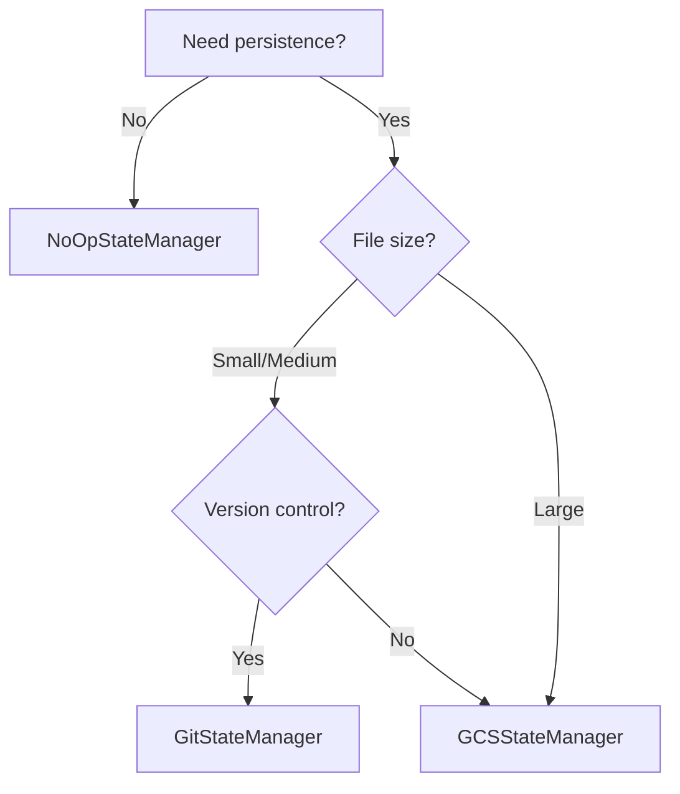

# State Management

State managers handle persistence of your workspace between sessions. This enables users to resume work or maintain isolated environments per user.

## State Manager Comparison

| Manager | Storage | Best For | Cost |
|---------|---------|----------|------|
| `NoOpStateManager` | None | Testing, ephemeral tasks | Free |
| `GitStateManager` | GitHub branches | Version control, collaboration | Free |
| `GCSStateManager` | Google Cloud Storage | Enterprise, large files | Pay per use |

## NoOpStateManager

No persistence. Workspace is lost when backend shuts down.

```python
from omniagents.backends.state_manager import NoOpStateManager
from omniagents.backends.local_backend import LocalBackend

backend = LocalBackend(
    project_id="ephemeral-task",
    state_manager=NoOpStateManager()
)
backend.start()
# ... work ...
backend.shutdown()  # All files are lost
```

**Use when:**

- Running one-off tasks
- Testing
- You don't need persistence

## GitStateManager

Saves workspace to GitHub branches. Each project gets its own branch.

```python
from omniagents.backends.state_manager import GitStateManager
from omniagents.backends.local_backend import LocalBackend

backend = LocalBackend(
    project_id="my-project",
    state_manager=GitStateManager()
)
backend.start()   # Loads from branch: state/my-project
# ... work ...
backend.shutdown()  # Commits and pushes to branch
```

**Requirements:**

1. Install GitHub CLI: `brew install gh` or `apt install gh`
2. Authenticate: `gh auth login`
3. Set repository (optional):
   ```bash
   export OMNIAGENTS_GITHUB_STATE_REPO="your-org/your-repo"
   ```

**How it works:**

1. On `start()`: Clones the branch if it exists, or creates empty workspace
2. On `shutdown()`: Commits all changes and pushes to branch
3. Branch name: `state/{project_id}`

**Benefits:**

- Free (GitHub)
- Version controlled (can see history)
- Easy to inspect (just clone the branch)
- Works with existing GitHub workflows

## GCSStateManager

Saves workspace snapshots to Google Cloud Storage.

```python
from omniagents.backends.state_manager import GCSStateManager
from omniagents.backends.local_backend import LocalBackend

backend = LocalBackend(
    project_id="my-project",
    state_manager=GCSStateManager()
)
backend.start()   # Downloads latest snapshot
# ... work ...
backend.shutdown()  # Uploads new snapshot
```

**Requirements:**

1. GCP credentials:
   ```bash
   export GOOGLE_APPLICATION_CREDENTIALS="/path/to/credentials.json"
   ```
2. Bucket name:
   ```bash
   export BUCKET_OMNIAGENTS="your-bucket-name"
   ```

**How it works:**

1. On `start()`: Downloads and extracts latest `.tar.gz` snapshot
2. On `shutdown()`: Creates `.tar.gz` of workspace, uploads with timestamp
3. Path: `gs://{bucket}/{project_id}/{timestamp}.tar.gz`

**Benefits:**

- Handles large files well
- Enterprise-grade reliability
- Timestamped snapshots (can restore any point)
- Filters out `.git`, `__pycache__`, `node_modules`

## StateManager Interface

All state managers implement this interface:

```python
class StateManager(ABC):
    @abstractmethod
    def save_snapshot(
        self,
        backend: ExecutionBackend,
        message: str = ""
    ) -> str:
        """Save current workspace state. Returns snapshot ID."""

    @abstractmethod
    def load_latest(
        self,
        backend: ExecutionBackend
    ) -> bool:
        """Load latest snapshot into workspace. Returns True if found."""

    @abstractmethod
    def list_snapshots(
        self,
        project_id: str
    ) -> list[SnapshotInfo]:
        """List all snapshots for a project."""

    @abstractmethod
    def cleanup(
        self,
        project_id: str
    ) -> None:
        """Delete all snapshots for a project."""
```

## Multi-Tenant Pattern

For applications with multiple users, use `project_id` to isolate workspaces:

```python
def get_backend_for_user(user_id: str) -> ExecutionBackend:
    """Create isolated backend per user."""
    return DockerBackend(
        project_id=f"user-{user_id}",  # Unique per user
        state_manager=GCSStateManager()
    )

# User A's session
backend_a = get_backend_for_user("alice")
backend_a.start()  # Loads Alice's files

# User B's session (completely isolated)
backend_b = get_backend_for_user("bob")
backend_b.start()  # Loads Bob's files
```

## Lifecycle Integration

State is automatically loaded and saved during backend lifecycle:

```python
backend.start()
# 1. Creates execution environment (Docker container, etc.)
# 2. Calls state_manager.load_latest() to restore files

backend.shutdown()
# 1. Calls state_manager.save_snapshot() to persist files
# 2. Destroys execution environment
```

## Choosing a State Manager



**Choose NoOpStateManager when:**

- Running one-off tasks
- Testing
- Prototype development

**Choose GitStateManager when:**

- You want version history
- Files are mostly code (small/medium)
- You're already using GitHub

**Choose GCSStateManager when:**

- You have large files (datasets, models)
- You need enterprise reliability
- You're building a production service
